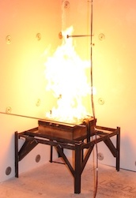
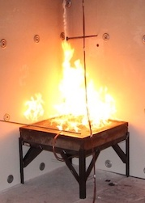
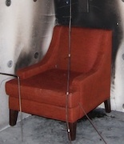
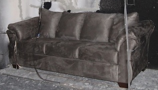

# Data Structure

Two plaintext __.csv__ files are included in the data directory for each experiment. The name of the file containing the time series data from all sensors for a given experiment matches the name of said experiment. The name of the second file contains the experiment name followed by **_Events**. Timing information of notable events (e.g., ignition, door open, etc.) from the experiment are included in this file.

## Experiment Names

The name of each experiment contains four parts separated by underscores, **[1]\_[2]\_[3]\_[4]**, which correspond to:

### [1] Fuel
Two natural gas burners were utilized as fuel sources for a number of the experiments. Each burner had a square opening on its top face. The side length of the smaller burner's orifice was 0.3 m, while that of the larger burner was 0.6 m. The flow of gas to the burner was set to produce fires with specific heat release rates (HRRs). Images of the two burners are presented below.

 

In addition to the gas burners, an upholstered chair and upholstered sofa were used as fuel sources during the experimental series. These furnishings are referred to as the "Red Accent Chair" and "Overstuffed Sofa". Each furniture item was comprised of a polyester (PE) outer covering, a wooden frame, and cushions composed of polyurethane foam covered by PE batting on the top and bottom. Images of the two upholstered furniture items are presented below.

 

The following table lists the notation used to refer to the different fuels in the experiment names:

| Name | Fuel |
|---------|-------------|
| 100kWSB | 0.3 m burner set to HRR of 100 kW |
| 100kW   | 0.6 m burner set to HRR of 100 kW |
| 250kW   | 0.6 m burner set to HRR of 250 kW |
| 500kW   | 0.6 m burner set to HRR of 500 kW |
| RedAccent | Red Accent Chair |
| Overstuffed | Overstuffed Sofa |

### [2] Door Status

The compartment door was either open or closed for the entire duration of every experiment. The second part of each experiment name specifies the door status for the experiment.

### [3] Fuel Location

Over the course of the experimental series, the fuels were placed at four different positions inside the compartment to study the effect of fuel location on the thermal environment. These positions --- corner, back, side, and center --- are referenced in the third part of the experiment names. Schematics showing the position of the burner at each location are presented below.

### [4] Replicate Number

To evaluate the repeatability of fire conditions produced by the different fuel sources, multiple experiments were conducted for nearly all configurations. The number at the end of each experiment name refers to the replicate number for the given configuration.

## Additional Information

Dimensioned floor plans of the compartment and instrumentation locations along with information about the measurement groups can be found here: [02_Info/README.md](02_Info/README.md)
